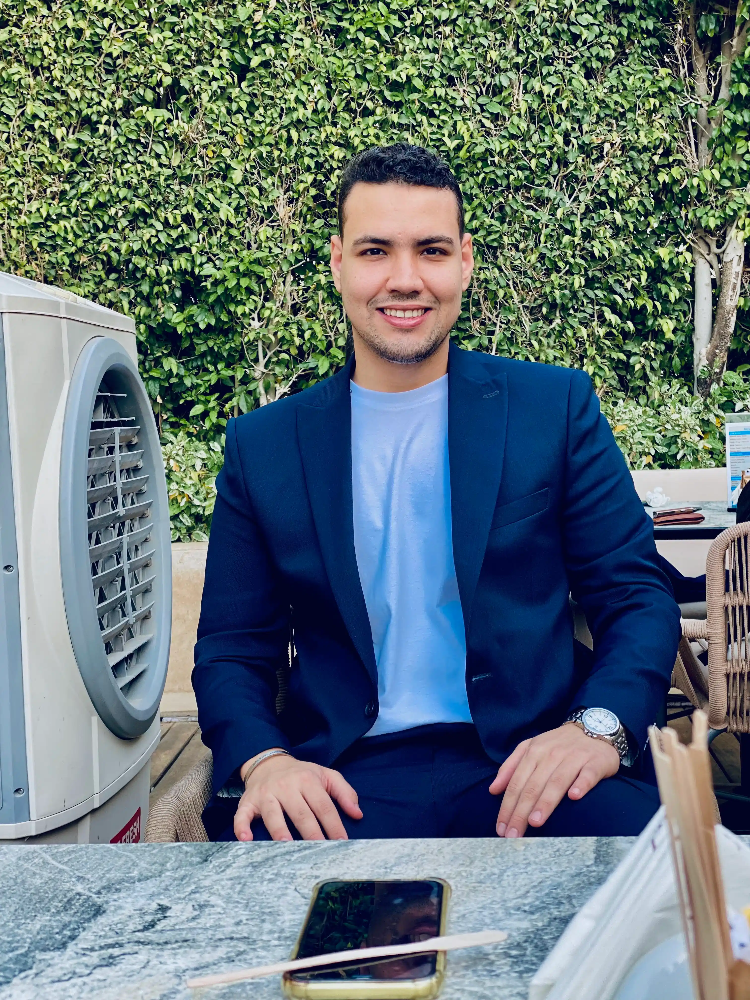
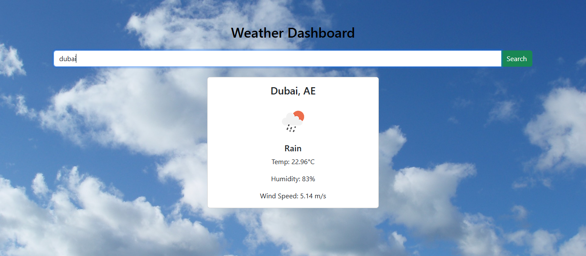
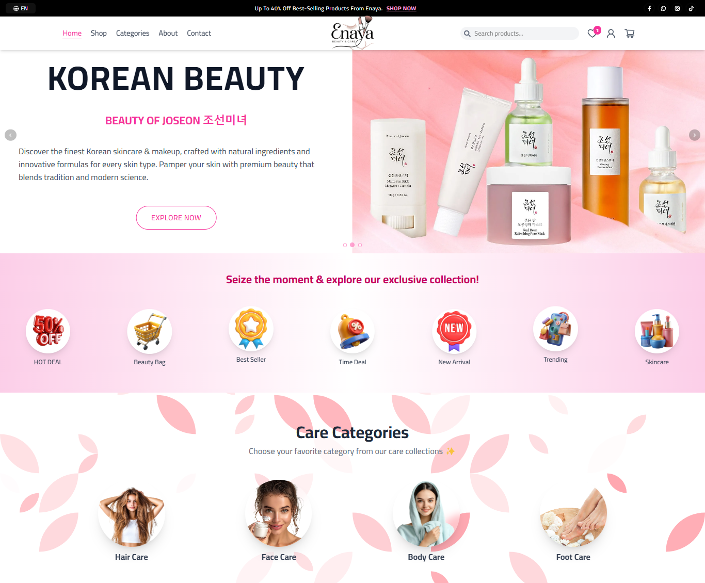
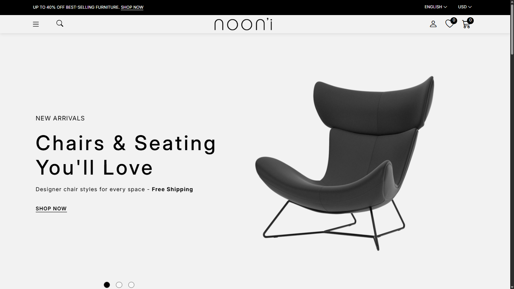
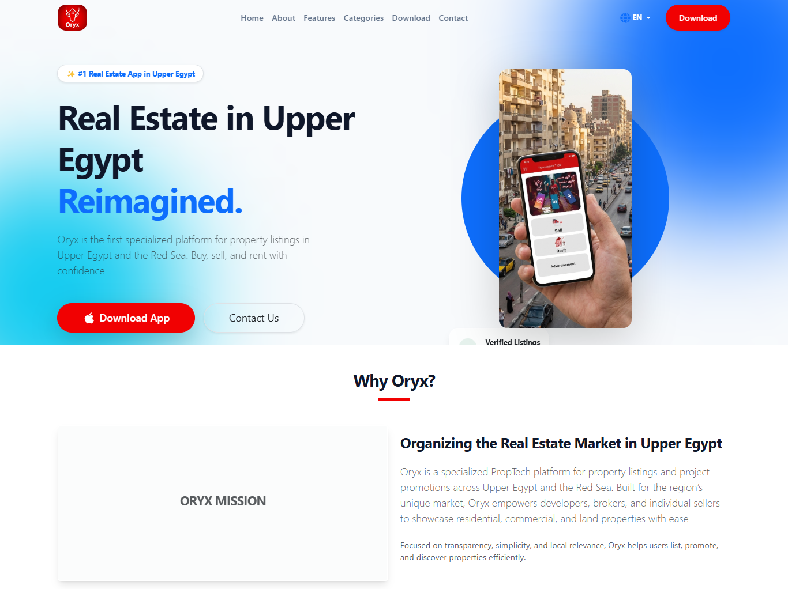

  

<h1 align="center">Ahmed Mohamed Ghallab</h1>
<h3 align="center">Front-End Developer</h3>

  <a href="mailto:eng.ahmedghallab@gmail.com">Email</a> • 
  <a href="https://linkedin.com/in/ahmedghallab22">LinkedIn</a> • 
  <a href="https://github.com/Ahmed-Ghallab">GitHub</a>

---

## 👨‍💻 About Me
Front-End Developer with a strong Computer Science background and hands-on experience building responsive, high-performance web applications using **React.js**, **Next.js**, and modern UI frameworks. Skilled in **JavaScript (ES6+)**, state management, and API integration, with a focus on writing clean, maintainable, and scalable code. Experienced in translating UI/UX designs into user-centered digital experiences.

---

## 🛠 Technical Skills

  
  
  
  
  
  
  

---

## 🎓 Education
**Bachelor’s Degree in Computer Science & Information Technology**  
Modern Academy for Computer Science, Egypt | 2018 – 2022  

---

## 💼 Work Experience

### Front-End Developer (Remote / Project-Based)
**Enaya E-Commerce Platform | 08/2025 – Present**
- Developed scalable multi-page e-commerce platform using React.js, Tailwind CSS, Zustand  
- Implemented reusable layouts and shared UI components for consistency  
- Built complete user flows including product listing, cart, and checkout  
- Integrated RESTful APIs using Axios and handled dynamic data  
- Optimized UI performance and responsiveness  
- Collaborated remotely with stakeholders to deliver production-ready features  

### Front-End Developer
**Fassla Software | Cairo, Egypt | 12/2024 – 12/2025**
- Built and maintained responsive web interfaces using HTML5, CSS3, JavaScript, and React.js  

---

## 📂 Portfolio Projects

| Project | Screenshot | Description |
|---------|------------|-------------|
| ToDo App | .png) | Simple task management app with CRUD functionality |
| Weather App |  | Real-time weather app fetching data from API |
| Enaya E-Commerce |  | Full e-commerce platform with cart & checkout |
| Nooni App |  | Product showcase app |
| Real Estate |  | Real estate listings platform |

---

## 📫 Contact Me
Feel free to reach out via **email** or **LinkedIn** for collaborations, freelance projects, or opportunities.

---

  Made with ❤️ by Ahmed Ghallab

